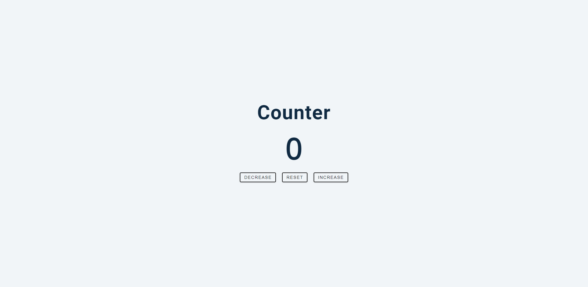

## Table of contents

- [Overview](#overview)
  - [The project](#the-project)
  - [Screenshot](#screenshot)
  - [Links](#links)
- [My process](#my-process)
  - [Built with](#built-with)
  - [What I learned](#what-i-learned)
  - [Continued development](#continued-development)

## Overview

### The challenge

- The aim of this project was to create a simple counter that increases, decreases or resets when the corresponding button is clicked. Additionally, if the
number shown on the counter is positive, it will be highlighted green, the same is true for negative numbers, only they will be coloured red.
### Screenshot



### Links

- Live Site URL: 

## My process

### Built with

- Semantic HTML5 markup
- CSS custom properties
- JavaScript

### What I learned

- How to modify the text content of an HTML element

```js
document.querySelector("#value").textContent = count;
```

- Forming longer if statements

```js
function numbers(action){
  if(action=="increase"){
    count++
  }if(action=="decrease"){
    count--
  }if(action=="reset"){
    count=0;
  }if(count>0){
    document.querySelector("#value").style.color="green";
  }else if(count<0){
    document.querySelector("#value").style.color="red";
  }else{
    document.querySelector("#value").style.color="";
  }
```


### Continued development

- I plan to keep honing my JavaScript skills, building projects to do so in order to become more competent at the language as a whole.

